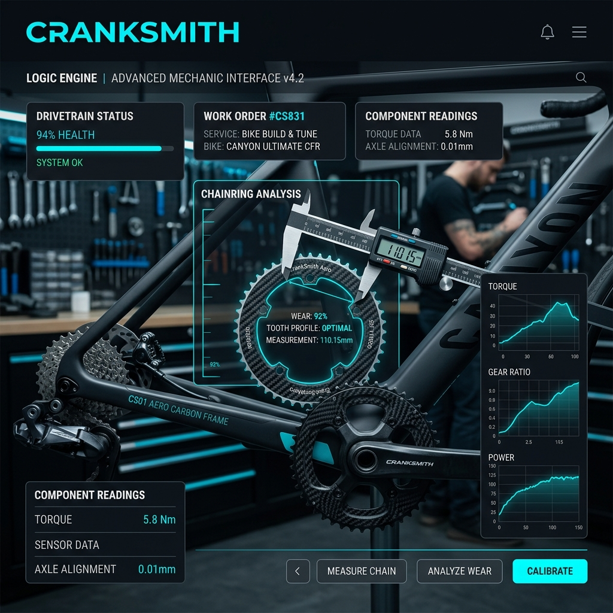

# 

# CrankSmith

### **The Mechanic's Logic Engine**
*Performance Bicycle Configuration, Gearing Analysis, and Weight Optimization*

---

[](https://cranksmith.com)
[](https://github.com/michaeleast/CrankSmithV3)
[](#mobile-deployment-reference)

**CrankSmith** is a professional-grade bicycle configuration tool designed for performance cyclists, DIY wrenchers, and upgrade-curious racers. Unlike generic bike builders, CrankSmith uses a **deterministic compatibility engine** to validate technical interoperability across road, gravel, and MTB standards.

---

## 🛠 The Core Toolset

CrankSmith is divided into four high-precision modules:

### 1. **Workshop (The Builder)**
A step-by-step assembly guide that validates every connection.
- **Zones**: Rolling Chassis (Frame/Fork/Wheels), Engine Room (BB/Crank), Drivetrain, and Cockpit.
- **Logic**: Intelligent freehub matching (XDR, MicroSpline, etc.), axle standard validation, and tire clearance guardrails.
- **Outputs**: Complete build sheets, CSV exports, and PNG share-cards.

### 2. **Drivetrain Lab (Gearing)**
Side-by-side performance simulation for gear ratio enthusiasts.
- **Comparison**: Compare two setups (e.g., 2x Road vs Mullet Gravel) side-by-side.
- **Analytics**: Top speed at cadence, climbing ratio, and "The Climbing Wall" (max sustainable gradient).
- **Course Awareness**: Upload profiles to see where your gearing hits the limit.

### 3. **Tire Pressure Calculator**
Precision recommendations based on the Berto formula and real-world ride feedback.
- **Contextual**: Front/Rear split based on rider weight, rim width, and surface type.
- **Discipline-Specific**: Guardrails for Tubeless, Hookless, Road, Gravel, and MTB.
- **Preference-Tuned**: Adjust between Grip and Speed profiles.

### 4. **The Scale (Weight Tracker)**
A value-oriented upgrade analyzer for "Weight Weenies."
- **Baseline**: Import from a build or enter measured weights.
- **Quick Wins**: Finds the best "Gram-per-Dollar" upgrades.
- **Rotating Weight**: Automatically applies a 2x multiplier for rim/tire/tube savings.

---

## 🚀 Current Status (March/April 2026)

- [x] **Web App**: 100% Core functionality live at [cranksmith.com](https://cranksmith.com).
- [x] **Compatibility Engine**: deterministic validation for FD, stem, seatpost, and brake levers implemented.
- [/] **Mobile Parity**: Refactoring iOS/Android (Capacitor) to match updated Web UX.
- [ ] **Unified Engine**: Deepening "What-If" propagation across all 4 tools.

---

## 🛠 Tech Stack

- **Core**: Next.js 16 (App Router), React 19, TypeScript
- **Styling**: Tailwind CSS v4, Framer Motion (for technical UI transitions)
- **Auth**: Clerk (Primary)
- **Database**: PostgreSQL via Prisma 5.10
- **Charts**: Recharts 3 (Drivetrain visualization)
- **Mobile**: Capacitor 7 (Native iOS/Android wrappers)

---

## 📱 Mobile Deployment Reference (Mechanic’s CLI)

*Use this section as a reference for building and submitting the native iOS/Android apps.*

### 🛠 Phase 1: Preparation
Before pushing any mobile update, ensure the web code is built and synced to the mobile project.

```bash
# 1. Build the production web assets
npm run build

# 2. Sync those assets and any config changes to the mobile folders
npx cap sync ios
npx cap sync android
```

### 📲 Phase 2: Building for iOS
```bash
# Open Xcode to handle the archive and submission
npx cap open ios
```

**In Xcode:**
1.  **Select Target**: Choose **'App'** in the sidebar.
2.  **Version/Build**: Update the **Version** (e.g., 3.0.0) and **Build** (e.g., 5) in the **General** tab.
3.  **Select Device**: In the top bar, select **"Any iOS Device (arm64)"**.
4.  **Archive**: Go to the menu: `Product` > `Archive`.
5.  **Distribute**: Once finished, the Organizer window will pop up. Click **"Distribute App"** and follow the prompts for App Store Connect.

### 🤖 Phase 3: Building for Android
```bash
# Open Android Studio
npx cap open android
```

**In Android Studio:**
1.  **Build Variant**: Ensure it's set to **'release'**.
2.  **Generate Bundle**: `Build` > `Generate Signed Bundle / APK`.
3.  **Play Console**: Upload the resulting `.aab` file to the Google Play Console.

---

## 👨‍💻 Engineering Guide

CrankSmith relies on an **Interface-Matching** architecture. We don't match parts to parts; we match parts to **Interfaces** (Standards).

- **Standard IDs**: BSA_68, BB86, T47, BOOST_148, XDR, etc.
- **Validation**: Found in `src/lib/validation.ts`.
- **Normalization**: Part specs are normalized in `src/lib/normalization.ts` before being stored.

---

*CrankSmith v3 — Built for the workshop, refined for the road.*

